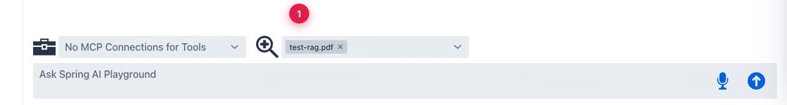
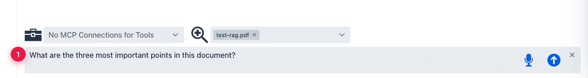

description: Tutorial 5 — RAG without tools. Use an indexed document as grounded context in a chat answer, with per-message retrieval traces from the Vector Database.

# Tutorial 5 — Chat With RAG

**Time** 5 min · **Difficulty** ★★☆ · **Surfaces** Agentic Chat, Vector Database

!!! abstract "Goal"
    Use the document you indexed in Tutorial 3 as grounded context in a chat answer — no tools yet, just retrieval-augmented generation.

## Steps

1. Open **Agentic Chat** with the `qwen3.5:latest` model already selected (from Tutorial 4 — it sticks until you change it).
2. Open the **documents** combo at the bottom and pick the indexed document. The chip appears in the combo; the model now has the document available as a RAG source.

*① the indexed `test-rag.pdf` is selected — every prompt in this chat will retrieve relevant chunks from the document before the model answers.*

3. Ask a question that should be answerable from the document.

*① grounded prompt — the model will retrieve chunks first, then answer using their content rather than generic memory.*

## What to observe

- The chat trace shows a **retrieval** step before the final answer — that's the chunks pulled from the vector store.
- If the answer doesn't reflect the document, go back to Tutorial 3 and re-check the similarity search. Ungrounded answers usually mean retrieval failed, not generation.

!!! warning "RAG only as good as your chunks"
    A great chat model can't recover from poorly chunked content. If your document has tables or code blocks, look at the chunked output in Vector Database before relying on it in chat — the splitter may have cut at unhelpful boundaries.

