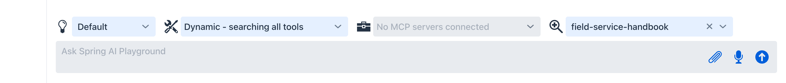
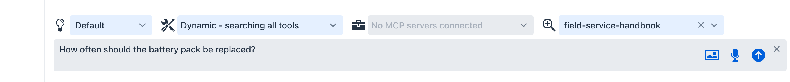
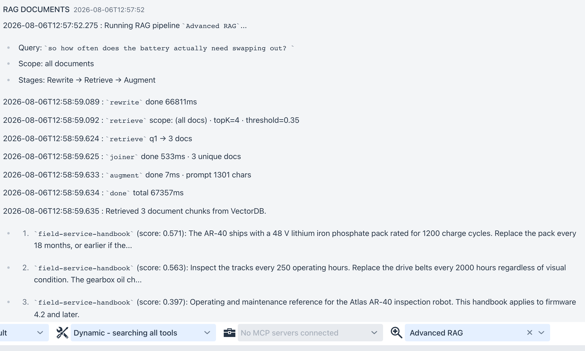

description: Tutorial 5 - RAG without tools. Use an indexed document as grounded context in a chat answer, read the retrieval trace, then upgrade the same question to a staged Modular RAG pipeline.

# Tutorial 5 - Chat With RAG

**Time** 7 min · **Difficulty** ★★☆ · **Surfaces** Agentic Chat, Vector Database

!!! abstract "Goal"
    Use the document you indexed in Tutorial 3 as grounded context in a chat answer - no tools yet, just retrieval-augmented generation - then see what changes when a query-transformation stage runs first.

## Steps

1. Open **Agentic Chat** with the `qwen3.5:9b` model already selected (from Tutorial 4 - it sticks until you change it).

2. Open the **RAG source** selector on the row above the prompt box and pick the document you indexed. The selector holds one source per conversation and lists two kinds: saved **pipelines** (with their stage count and extra LLM-call cost) and indexed **documents** (marked `retrieval only`). Start with the document.

*① the RAG source selector - each row says whether it is a pipeline or a plain document, so the cost of the choice is visible before you send anything.*

3. Ask a question that should be answerable from the document.

*① grounded prompt - retrieval runs first, then the model answers from the retrieved chunks rather than generic memory.*

## What to observe

- A **RAG** panel appears above the answer with the stages that ran and the documents retrieval returned. With a plain document source the trace reads `Stages: Retrieve → Re-rank → Augment` - no stage costs an extra LLM call, and retrieval is the search itself.
- If the answer doesn't reflect the document, go back to Tutorial 3 and re-check the similarity search. Ungrounded answers usually mean retrieval failed, not generation.

!!! warning "RAG only as good as your chunks"
    A great chat model can't recover from poorly chunked content. If your document has tables or code blocks, look at the chunked output in Vector Database before relying on it in chat - the splitter may have cut at unhelpful boundaries.

!!! tip "Just want to talk about one file?"
    You do not have to index it first. Drop the file on the prompt box and the chat ingests it on its own - full text for a small file, chunks plus an always-present overview for a larger one - and you can register it in the Vector Database later with one click. [Tutorial 17](17-attach-a-document.md) walks through it.

## Going further: the same question through a pipeline

A document source runs plain similarity search. A **pipeline** can reshape the question first, which is the difference between Naive RAG and Advanced RAG in the [Spring AI reference](https://docs.spring.io/spring-ai/reference/api/retrieval-augmented-generation.html).

1. In **Vector Database**, click **New RAG Pipeline**. On the **Pre-Retrieval** tab enable **Rewrite**. On the **Retrieval** tab pick the same document as the search scope. On the **Post-Retrieval** tab untick **Re-rank by score** (it is on by default; leaving it on just adds a fourth, LLM-free stage). Save it.

2. Back in chat, switch the RAG source to the new pipeline. Its row now reads `pipeline · stages: 3 · +1 LLM calls` - rewrite, retrieve, and augment, of which only the rewrite costs an extra model call.

3. Ask deliberately conversationally - something like `so what did it say about how often the battery needs swapping out?` - the kind of phrasing that embeds badly.

*① `Stages: Rewrite → Retrieve → Augment` and one timed line per stage. The rewrite ran before retrieval and took 66 of the turn's 67 seconds on a local model, which is what `+1 LLM calls` costs in practice.*

The trace is the point. Each stage is its own timed line, so you can see which one was slow and whether retrieval returned anything before blaming the answer. Compare it against the same question on the plain document source: same corpus, different path to it.

Full details of the four stages and what each maps to in Spring AI: [Pipeline Studio](../features/rag/pipeline-studio.md).

Next: [Tutorial 6 - Tools and RAG Together](6-tools-and-rag.md) combines this with live tool execution.
