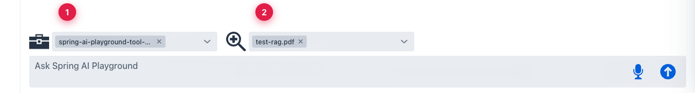
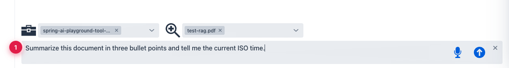

Description: Tutorial 6 — run a single chat turn that needs both grounded knowledge and live tool execution. The full Spring AI Playground composition flow.

# Tutorial 6 — Tools and RAG Together

**Time** 6 min · **Difficulty** ★★★ · **Surfaces** Agentic Chat (full)

!!! abstract "Goal"
    Run a single chat turn that needs both grounded knowledge *and* live tool execution. This is the full product workflow — what the rest of the tutorials build toward.

## Setup

Before sending the prompt, make sure you have:

- a tool you trust — any built-in (`getCurrentTime`, `getWeather`, …) is fine, or one you authored in Tool Studio
- an indexed document from Tutorial 3
- a tool-capable model — `qwen3.5:latest` or `gemma4:latest`

## Steps

1. Enable both controls at the bottom: the **MCP connection** chip and the **document** chip.

*① the MCP connection is active — every tool the connection exposes is in the inventory, ② the RAG source is active — the model will retrieve chunks before answering. The model can use either, both, or neither, per turn.*

2. Send a prompt that requires both. The example below asks for a document summary *and* a current ISO time — the model should retrieve from the doc and call `getCurrentTime` in the same turn.

*① one prompt that needs RAG + tools — the model decides on its own which to use when.*

## What to observe

- The trace shows **both** a retrieval step and an MCP tool call.
- The final answer references concrete document content (not generic) **and** uses the tool result (not made up).
- If only one happens, that's a model-quality signal — switch to `gemma4:latest` and try again.

!!! tip "Why this is the most important tutorial"
    Spring AI Playground is built around composition. Tool Studio creates capabilities, MCP Server validates them, Vector Database prepares grounded knowledge, and Agentic Chat composes all of that. This tutorial is where the architecture becomes visible from a single chat turn.

→ Next: [Tutorial 7 — Weather to Slack: A Two-Tool Chain](7-weather-to-slack.md)
