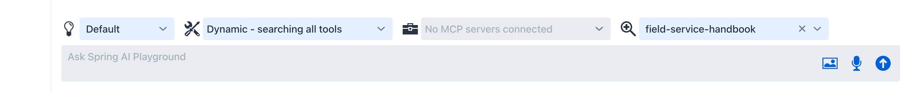
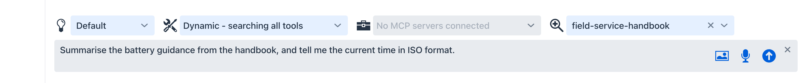

description: Tutorial 6 - run a single chat turn that needs both grounded knowledge and live tool execution. The full Spring AI Playground composition flow.

# Tutorial 6 - Tools and RAG Together

**Time** 6 min · **Difficulty** ★★★ · **Surfaces** Agentic Chat (full)

!!! abstract "Goal"
    Run a single chat turn that needs both grounded knowledge *and* live tool execution. This is the full product workflow - what the rest of the tutorials build toward.

## Setup

Before sending the prompt, make sure you have:

- a tool you trust - any built-in (`getCurrentTime`, `getWeather`, ...) is fine, or one you authored in Tool Studio, or an external MCP server you connected in Tutorial 2
- an indexed document from Tutorial 3, or a pipeline built on it
- a tool-capable model - `qwen3.5:9b` or `gemma4:e4b`

## Steps

1. Set both selectors on the row above the prompt box: choose tools in the **tool selector**, and a **RAG source** in the RAG selector. They are independent - the model can use either, both, or neither on a given turn.

*① the tool selector, here left in the shipped **Dynamic** mode so the model searches the whole catalogue on demand (pick tools manually instead if you prefer a fixed set), ② the RAG source is active, so retrieval runs before the model answers.*

2. Send a prompt that requires both. The example below asks for a document summary *and* a current ISO time - the model should retrieve from the doc and call `getCurrentTime` in the same turn.

*① one prompt that needs RAG + tools - the model decides on its own which to use when.*

## What to observe

- The turn shows **both** a RAG panel and a tool-call panel, each with its own timing.
- The final answer references concrete document content (not generic) **and** uses the tool result (not made up).
- If only one happens, that's a model-quality signal - switch to `gemma4:e4b` and try again.

!!! tip "Why this is the most important tutorial"
    Spring AI Playground is built around composition. Tool Studio creates capabilities, MCP Server validates them, Vector Database prepares grounded knowledge and the pipeline that retrieves it, and Agentic Chat composes all of that. This tutorial is where the architecture becomes visible from a single chat turn.
