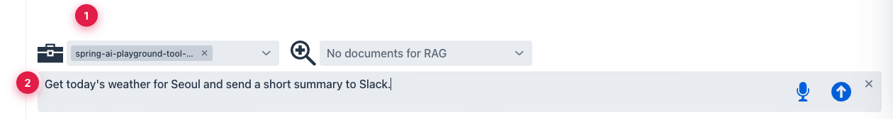

description: Tutorial 7 — chain two built-in tools (getWeather → sendSlackMessage) in a single chat turn. See the agent loop chain real actions.

# Tutorial 7 — Weather to Slack — A Two-Tool Chain

**Time** 4 min · **Difficulty** ★★★ · **Surfaces** Agentic Chat

!!! abstract "Goal"
    Trigger a chain of two built-in tools (`getWeather` → `sendSlackMessage`) in a single chat turn. Watch the agent loop in action: plan → call tool A → read result → call tool B with that result → summarize.

This is the canonical *"try an agentic workflow"* task on the Home checklist. No Tool Studio authoring required — both tools are pre-loaded and already passed their Local Pass.

!!! warning "Slack webhook required"
    `sendSlackMessage` posts to whatever URL is in `SLACK_WEBHOOK_URL`. Set it in the desktop launcher's **Environment Variables** (or as a shell env var when running from source) **before** launching the app. Without it, the second tool call will fail and the chain breaks at step 2.

## Steps

1. In **Agentic Chat**, switch to a tool-capable model (`qwen3.5:9b` works; `gemma4:e4b` chains more reliably for longer prompts), tick **Use built-in MCP server in this chat**, and confirm `getWeather` and `sendSlackMessage` are selected in the exposed-tools list.
2. Send this prompt verbatim:

    ```text
    Get today's weather for Seoul and send a short summary to Slack.
    ```


*① Built-in MCP enabled — `getWeather` and `sendSlackMessage` are both in the inventory, ② one prompt that requires two tool calls in the right order.*

3. Watch the chat stream:
    - the assistant calls `getWeather` with `Seoul`
    - the tool returns a compact weather payload
    - the assistant reasons over the result and calls `sendSlackMessage` with a short natural-language summary
    - the assistant's final turn confirms the post

4. Open Slack and verify the message landed.

## What to validate

- **Two distinct tool calls in order**, not one. The MCP TOOLS block in the trace should list both, with `getWeather` before `sendSlackMessage`.
- The Slack message body is **derived from** the weather result — the agent is chaining, not guessing.
- If either tool fails, the failure surfaces in the chat with the tool name and error. The same failure would have blocked the tool from earning its Local Pass — so `sendSlackMessage` failing here means the webhook URL is wrong, not the tool itself.

## Where to go from here

- Replace `sendSlackMessage` with a Tool Studio tool of your own. The moment it passes its Local Pass, it's live on the built-in MCP server and the chat can use it the same way.
- Combine this flow with a RAG document — *"summarize this policy document and post the summary to Slack"* — and you've got Tutorial 6's composition phrased as a real task.
