description: Tutorial 9 — activate MCP Everything from the catalog and drive every Inspector primitive (Tools · Resources · Prompts · Roots · Sampling · Elicitation).

# Tutorial 9 — MCP Everything: All 8 Primitives in One Walkthrough

**Time** 12 min · **Difficulty** ★★☆ · **Surfaces** MCP Server (catalog + Inspector)

!!! abstract "Goal"
    Activate **MCP Everything** from the Default MCP Servers and drive every Inspector primitive — Tools, Resources, Prompts, Ping, Notifications, Roots, Sampling, Elicitation — against a single server in one sitting. No credentials, no tenant setup; everything in this tutorial runs against a server that has no auth surface.

!!! info "Why MCP Everything"
    MCP Everything is the official MCP working group's reference test server. It is the **only** publicly available server that intentionally implements every protocol primitive — including the inverted client-side ones (Sampling, Elicitation) that real-world servers usually skip. If a primitive doesn't light up here, the bug is almost certainly on the *client* side (the playground), which is exactly why it's catalogued in the first place. For the per-primitive matrix and the catalog template, see [Default MCP Servers → Examples → MCP-Everything](../features/default-mcp-catalog/examples.md#MCP-Everything). For the spec-level "what each primitive is" explanation, see [MCP Inspector](../features/mcp-server/inspector.md).

## Prerequisites — Node.js 18+ (or Docker)

The catalog template ships per-OS STDIO commands that fetch and spawn `@modelcontextprotocol/server-everything` via `npx` (`npx.cmd` on Windows). You either need Node.js 18+ on the host, or you can switch to the Docker variant in one form edit.

=== "macOS"
    ```bash
    # Homebrew (recommended)
    brew install node

    # or the official installer
    # https://nodejs.org/en/download
    ```
    The catalog activates with `npx -y @modelcontextprotocol/server-everything` and works once `npx` is on `PATH`.

=== "Ubuntu / Debian"
    ```bash
    # Distro packages — quick path
    sudo apt update
    sudo apt install nodejs npm

    # Or nvm if you need a specific Node version
    curl -o- https://raw.githubusercontent.com/nvm-sh/nvm/v0.40.1/install.sh | bash
    nvm install --lts
    ```
    Verify with `node --version` (must report `v18.x` or newer).

=== "Fedora / RHEL"
    ```bash
    sudo dnf install nodejs npm
    # or for a specific stream:
    sudo dnf module install nodejs:20/common
    ```

=== "Windows"
    ```powershell
    # winget (PowerShell, recommended)
    winget install OpenJS.NodeJS.LTS

    # or the official installer
    # https://nodejs.org/en/download
    ```
    The catalog automatically picks the Windows variant (`npx.cmd`) when it detects the host OS.

=== "Docker (any OS)"
    If you'd rather not install Node, switch the activation form's transport fields after clicking the catalog row:

    | Field | Value |
    |---|---|
    | **Command** | `docker` |
    | **Arguments** | `run`, `-i`, `--rm`, `tzolov/mcp-everything-server:v2` |

    The Docker form is what the in-app QA recipe uses as a smoke test — it is the same image, same protocol surface, just packaged.

!!! tip "MCP Everything needs no credentials"
    Unlike the other catalog entries (Gmail, Slack, GitHub, …) that wrap a real account, MCP Everything is a **synthetic** server — every tool is implemented internally with mock data. You won't be asked for a token, a tenant ID, or an OAuth grant. That makes it the right first stop for verifying that the playground's MCP client wiring works end-to-end before you spend OAuth setup time on a real vendor.

## 1. Activate from the catalog

1. Open **MCP Server**. The left sidebar shows three layers — **Built-in MCP** (pinned), **Active MCP**, and **Inactive MCP** (the 57-entry catalog).
2. Scroll the **Inactive MCP** layer to the `Example` category group, or type `everything` into the filter bar at the top — both surface the **MCP Everything** entry.
3. Click the row. **You do not pick the OS variant manually** — the playground reads the host OS at startup and the configuration form opens already pre-filled with the matching command + args. The table below shows what gets selected for each platform:

    | Host OS | Command | Arguments |
    |---|---|---|
    | macOS / Linux | `npx` | `-y @modelcontextprotocol/server-everything` |
    | Windows | `npx.cmd` | `-y @modelcontextprotocol/server-everything` |

    !!! tip "Per-OS auto-selection covers every stdio catalog entry"
        The same mechanism applies to all 8 stdio entries in the catalog — Git, Puppeteer, Playwright, Memory, Sequential Thinking, SQLite, Brave Search, and MCP Everything. Each ships in three OS-specific JSON variants (`default-mcp-specs-stdio-mac.json` / `-linux.json` / `-windows.json` under `src/main/resources/mcp/`), and the sidebar surfaces only the variant matching your host so the pre-filled command works without editing. macOS / Linux variants use `npx` or `uvx`; Windows variants use `npx.cmd`. See [MCP Server → Catalog & Sidebar Filtering](../features/mcp-server/index.md#catalog-sidebar-filtering) for the mechanism.

4. *(Docker alternative only)* Replace **Command** with `docker` and **Arguments** with `run`, `-i`, `--rm`, `tzolov/mcp-everything-server:v2`.
5. Click **Test Connection** first — a transient client runs `initialize` + one-shot `listTools` without touching the live connection map. A green OK tells you the spawn + JSON-RPC handshake works on your host.
6. Click **Save & Connect**. The row moves from **Inactive MCP** into **Active MCP** under the `Example` category, and the status dot turns green.

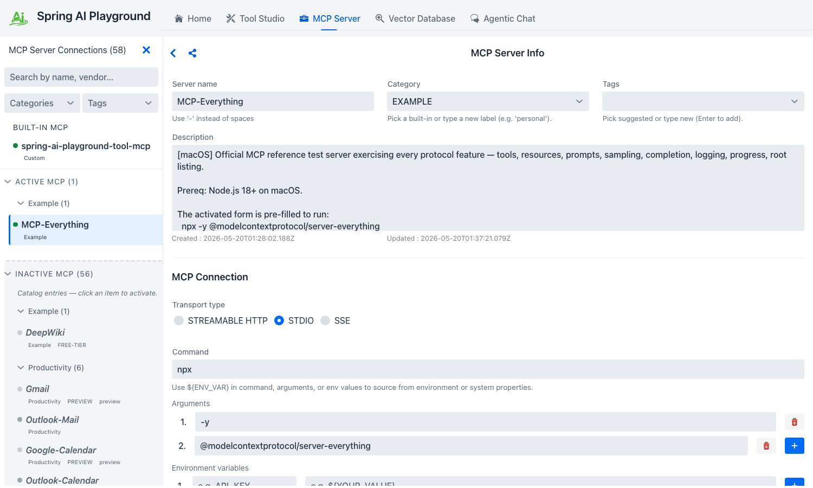
*The configuration form opens already filled in with the host-OS variant — `npx` on macOS/Linux, `npx.cmd` on Windows. **Test Connection** runs a transient `initialize` + `listTools` without touching the live map; **Save & Connect** then promotes the row into Active MCP under the Example group.*

!!! tip "If the status dot stays gray or turns red"
    The most common causes are missing `npx` on `PATH` (Node not installed or shell not refreshed), or the host blocking the npm registry. Switch to the Docker variant on the same form and click **Save & Connect** again — that bypasses both.

## 2. Verify connectivity with Ping

The connection's right pane now exposes the **MCP Inspector** below the form. Eight tabs sit side by side; the default selection is **Tools**.

1. Click the **Ping** tab.
2. Click the single play button on the Ping card.
3. The result lands inline — an OK badge, elapsed milliseconds, and an ISO timestamp. If it's an ERROR, the transport itself is unhealthy; everything else in this tutorial will fail until ping succeeds.

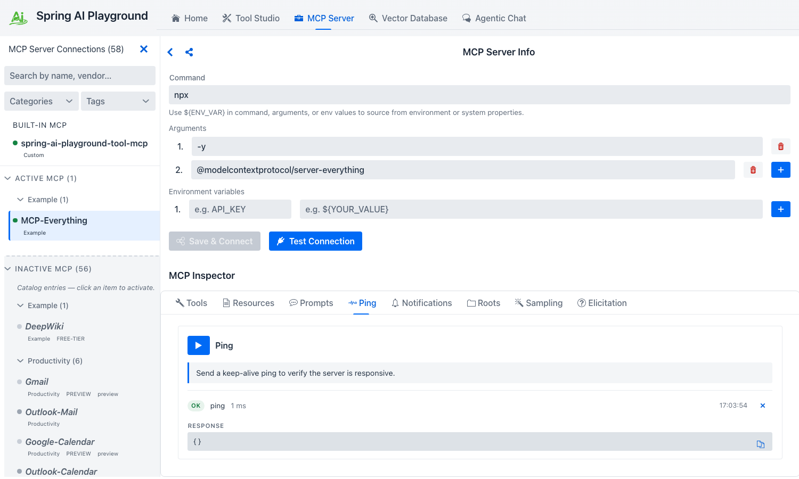
*A single play button, an OK badge, the round-trip duration, and the server's ISO timestamp — the smallest possible end-to-end JSON-RPC check.*

Ping proves the JSON-RPC channel is alive end-to-end *independent of any tool or resource call* — which is why it's the right first signal after Save & Connect. See [Inspector → Ping](../features/mcp-server/inspector.md#ping) for the spec context.

## 3. Tools — call three representative tools

Switch to the **Tools** tab. Each tool the server publishes from `tools/list` renders as a full-width card with its description, schema-typed inputs, and a **Run tool** button. MCP Everything publishes 15 tools; you'll exercise three that demonstrate three different shapes of input and output.

### Echo — the simplest possible round-trip

1. Find the **Echo Tool** card.
2. Type `hello from playground` into the `message` input.
3. Click **Run tool**.
4. The inline result panel shows OK, elapsed ms, the REQUEST block (the JSON-RPC args you sent), the RESPONSE block (the server's echo), and a **Raw** toggle that swaps in the full JSON-RPC envelope.

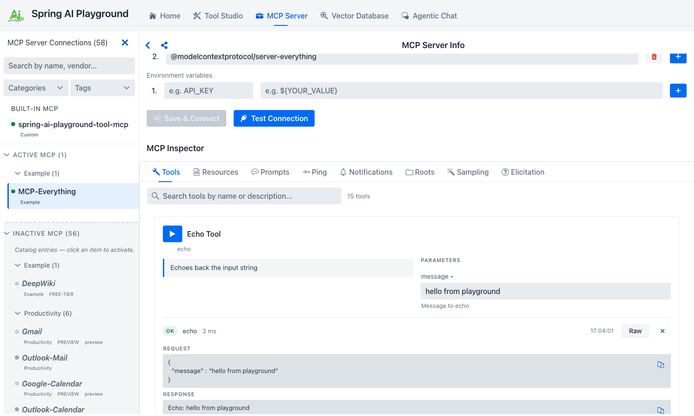
*The same REQUEST / RESPONSE / Raw layout every Tools call uses — the round-trip envelope is one toggle away when you need to debug at the wire level.*

### Get Sum — typed numeric inputs

1. Scroll to the **Get Sum Tool** card (this is MCP Everything's `add` tool — the playground surfaces it under its display name). The two `a` / `b` fields render as **number inputs** because the JSON Schema declares `"type": "number"`.
2. Enter `2` and `3`.
3. Click **Run tool**. The response is `5`.

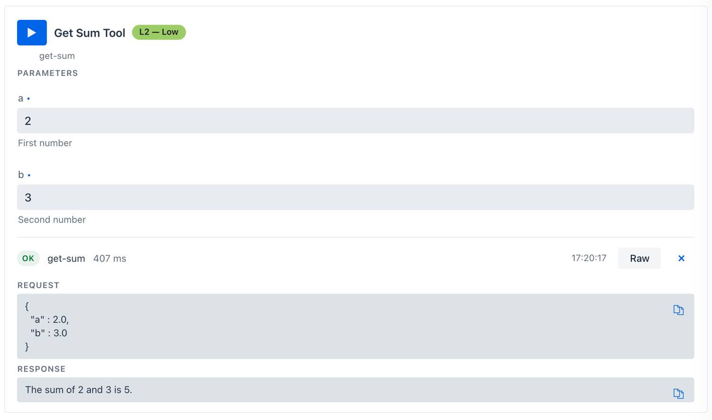
*The schema declared `"type": "number"`, so the Inspector renders proper numeric inputs — not free-text. The Raw envelope shows `arguments: { a: 2, b: 3 }` typed accordingly.*

This is how the Inspector's input controls track JSON Schema — boolean → checkbox, enum → dropdown, array/object → JSON editor. See [Inspector → Tools](../features/mcp-server/inspector.md#tools) for the full mapping.

### Get Annotated Message — content annotations + image content

1. Find the **Get Annotated Message Tool** card. It exposes a `messageType` **Select** (enum: `error` · `success` · `debug`) and an `includeImage` **checkbox**.
2. Pick `success`, check the box, click **Run tool**.
3. The response is a structured `content` array — one text block carrying the server-declared `annotations` (priority + audience hints the model can use), and one base64 image block the Inspector renders as a preview tile with the byte length displayed.

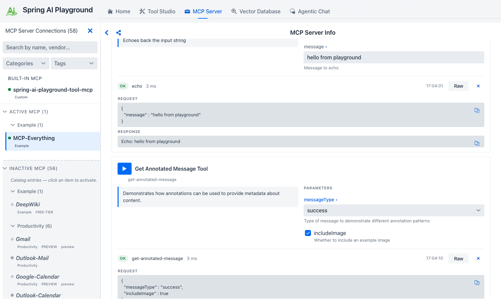
*The text block's `annotations` (priority + audience) are routing hints the model can lean on; the image block is decoded inline so you can verify the bytes without leaving the Inspector.*

!!! tip "Validate every new tool here first"
    Tools that fail in the Inspector fail in Agentic Chat too, but the chat error is wrapped in the agent's reasoning trace and harder to debug. Save yourself a turn — run every new tool here once before letting a model invoke it.

## 4. Resources — static URIs and templated URIs

Switch to the **Resources** tab. The Inspector splits the section into two sub-sections — `RESOURCES (N)` for the server's static URIs and `RESOURCE TEMPLATES (N)` for parameterised templates.

### Read a static resource

1. The `RESOURCES 7` header reflects MCP Everything's synthetic static set — seven `demo://resource/static/document/*.md` entries (`architecture.md`, `extension.md`, `features.md`, `how-it-works.md`, `instructions.md`, `startup.md`, `structure.md`).
2. Pick any card (the first one, `architecture.md`, is fine). The card shows the URI, the server-declared `mimeType` chip (`text/markdown`), and a server-supplied description.
3. Click **Read resource**. The body lands inline as `CONTENTS` — text content renders verbatim, binary content surfaces as a base64 preview.

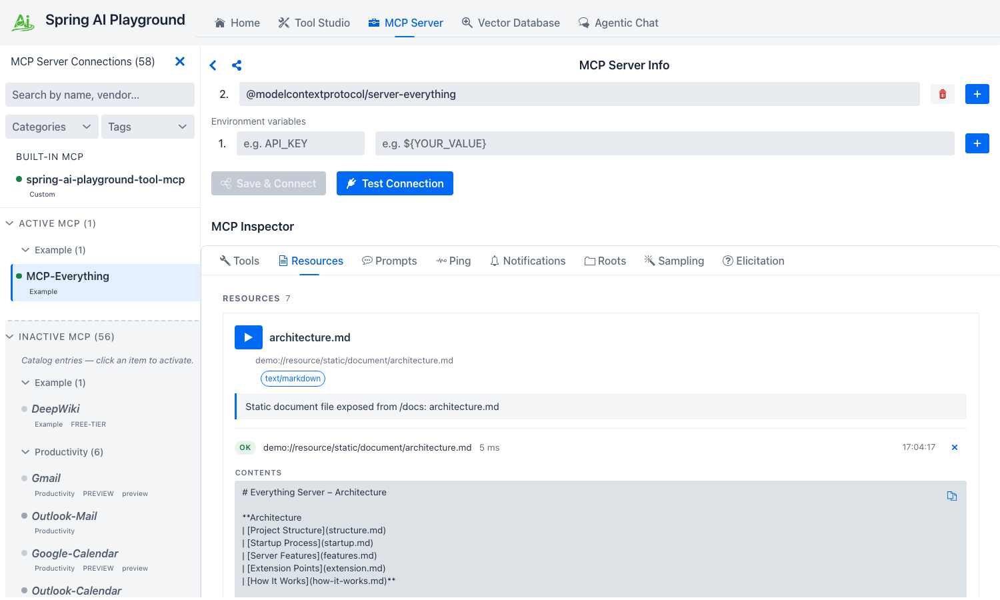
*Each row reads its URI inline — no tab switch, no separate viewer. The `text/markdown` chip and the OK badge confirm the mimeType and round-trip duration the server reported.*

### Read a templated resource

1. Below the static list, the `RESOURCE TEMPLATES 2` section exposes two parameterised templates — `demo://resource/dynamic/text/{resourceId}` and `demo://resource/dynamic/blob/{resourceId}`.
2. Pick the **Dynamic Text Resource** template. The card renders a `VARIABLES` block with a JSON-Schema-typed input for `resourceId`. The description warns that the variable **must be an integer**.
3. Type `42` into `resourceId` and click **Expand template and read**. The server substitutes the variable, resolves the URI to `demo://resource/dynamic/text/42`, and returns a deterministic text body keyed on the variable.

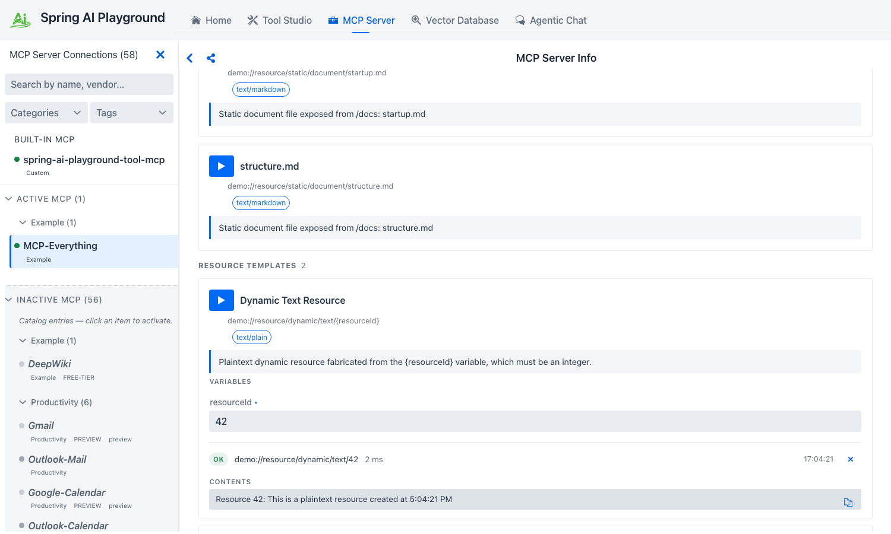
*Templates declare their URI variables with JSON-Schema-typed inputs — same control pool the Tools tab draws from — and the resolved URI (`demo://resource/dynamic/text/42`) lands above the body so you can confirm the substitution worked.*

See [Inspector → Resources](../features/mcp-server/inspector.md#resources) for the static / template distinction in the MCP spec.

## 5. Prompts — simple, arguments, and completable

Switch to the **Prompts** tab. Prompts are named, parameterised message templates the server can render for the client. MCP Everything publishes three that exercise the three shapes you'll meet in the wild.

### `simple-prompt` — no arguments

1. The `Simple Prompt` card has only a name and a description.
2. Click **Get prompt**. The server returns a rendered `messages` array ready to feed a model. There is nothing to fill in because the prompt takes no arguments.

### `args-prompt` — required + optional arguments

1. The `Arguments Prompt` card requires `city` and accepts an optional `state`.
2. Fill in `city: Seoul`, `state: South Korea`.
3. Click **Get prompt**. The rendered messages substitute your values into the server's template.

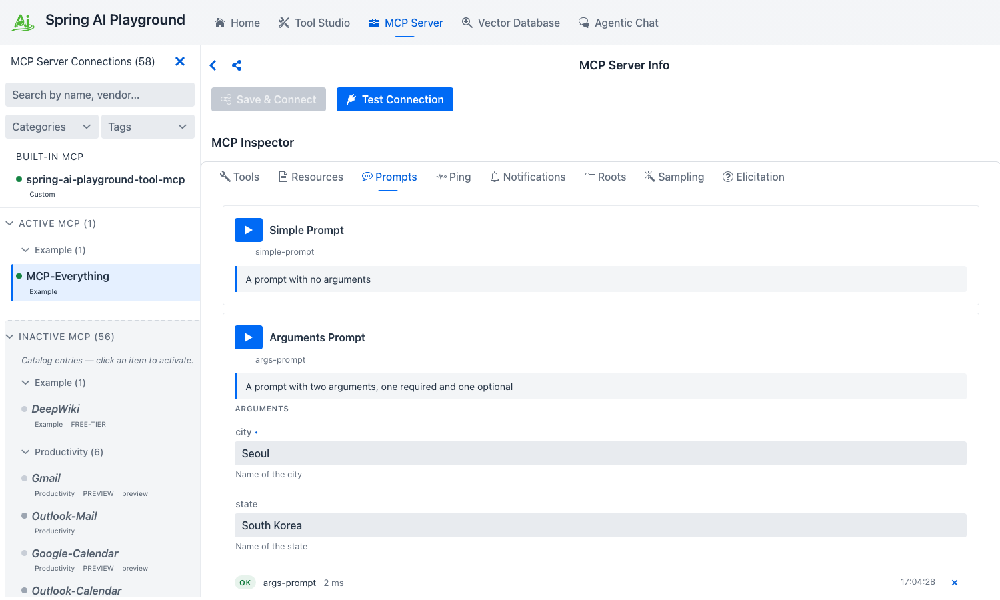
*The rendered `messages` array is what a chat client would feed straight into a model — the playground shows it verbatim so you can sanity-check the substitution before wiring it into Agentic Chat.*

### `completable-prompt` — argument completion via `completion/complete`

1. The `Team Management` card declares its `department` argument as **completable**.
2. Start typing into the `department` field. As you type, the Inspector fires `completion/complete` against the server and surfaces the returned suggestions inline — this is the only place in the playground where MCP completion is observable.
3. Pick a suggestion (or type your own) and click **Get prompt** to render the prompt.

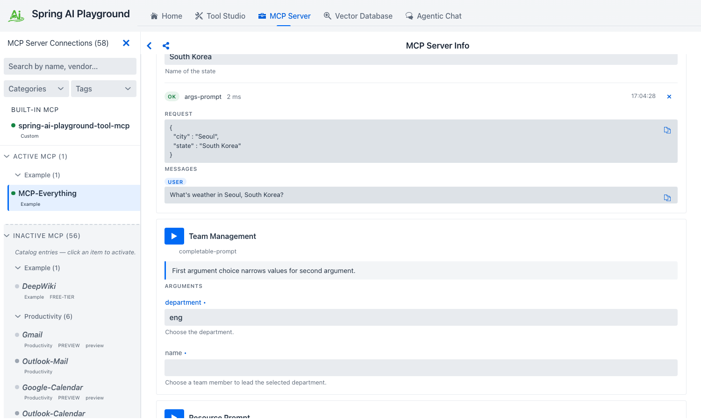
*This is the only place in the playground that exercises MCP's `completion/complete` — the server populates the suggestions live as you type, the same way an IDE renders symbol completions.*

See [Inspector → Prompts](../features/mcp-server/inspector.md#prompts) for the spec contract.

## 6. Notifications — turn on the live feed

Notifications are *unsolicited* messages from the server to the client — list-changed events, structured log records, progress updates. Switching to the Notifications tab right after connect already shows a few — MCP Everything emits a `TOOLS_CHANGED` notification on every reconnect so the client can re-fetch `tools/list`.

1. Switch to **Notifications**. You'll already see a small set of `TOOLS_CHANGED` rows — the timestamps cluster around when MCP Everything finished its initial handshake. Each row shows a method/topic chip, a one-line summary, and an ISO timestamp.
2. To generate more, go back to **Tools** and run the **Trigger Long Running Operation Tool** (no inputs). That tool emits per-step `notifications/progress` records the Inspector folds into the same feed.
3. Use the **Set logging level…** dropdown at the top to filter, or click **Clear** to start a fresh feed.

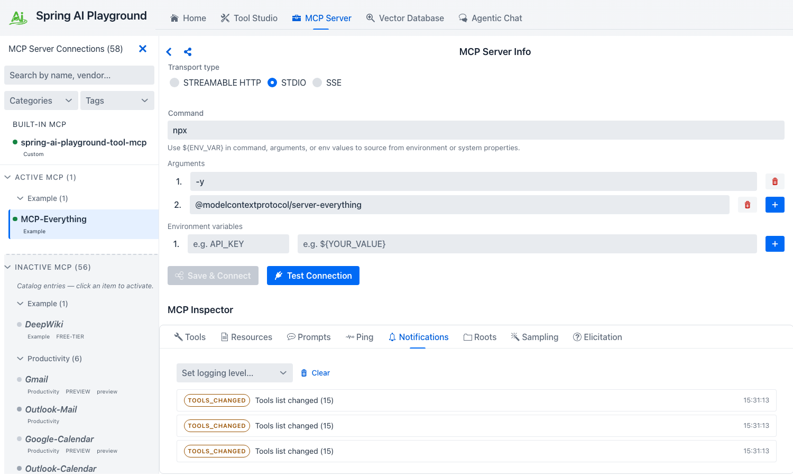
*Server push notifications only surface here — chat will never show them, so this tab is the source of truth for what change events a server actually emits.*

!!! tip "Why this tab matters"
    The chat surface does not surface server push notifications — they only land here. This tab is the canonical way to verify that an external server actually emits the change events it claims to before you wire that behaviour into chat-side code.

## 7. Roots — advertise a directory to the server

A *root* is a file or URI the playground (acting as the MCP client) advertises to the server as something the server may operate on. MCP Everything calls `roots/list` on startup; you decide what it sees.

1. Switch to the **Roots** tab. The default state is empty — "No roots advertised."
2. Fill in the inline form:
    - **URI** — `file:///tmp/mcp-demo` (any URI you want the server to see)
    - **Name** — `mcp-demo` (optional human-readable label)
3. Click **Add Root**. The playground attempts to push `notifications/roots/list_changed` to the server.

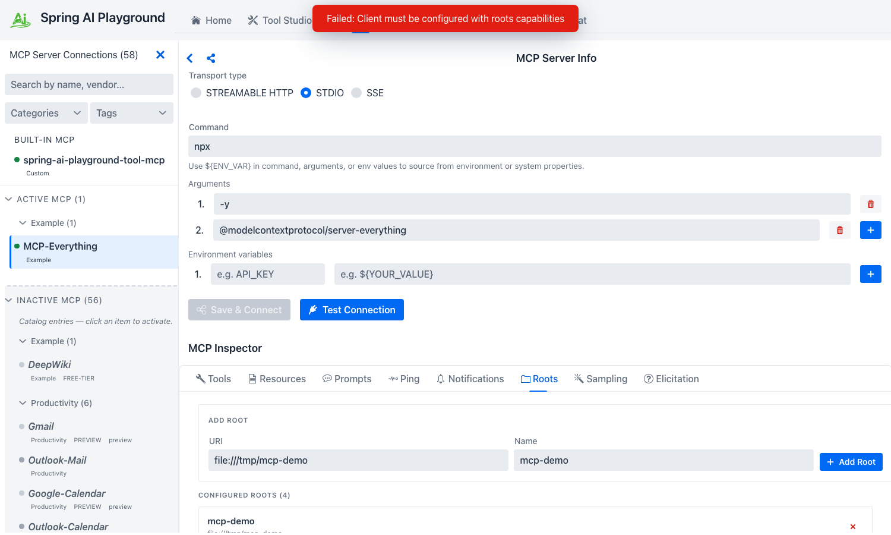
*The ADD ROOT form takes a URI plus an optional human-readable label, then notifies the server via `notifications/roots/list_changed` so it can re-fetch the set.*

!!! warning "Roots capability negotiation"
    The screenshot above shows the form filled but a **"Client must be configured with roots capabilities"** toast — that error fires when the playground's MCP client hasn't declared the `roots` capability during `initialize` to the connected server. Roots advertisement is currently a partial implementation; the form + protocol path is wired, but the client-side capability advertisement is on the roadmap.

!!! note "Roots are advisory, not enforcement"
    Adding a root does **not** grant the server filesystem access. It only tells the server "if you do filesystem-style operations, here are the URIs I've opted to expose." Enforcement lives in the playground's sandbox (`safety.fs`), not in the roots list. See [Inspector → Roots](../features/mcp-server/inspector.md#roots) for the spec context.

## 8. Sampling — let the server run a model turn through the playground

*Sampling* inverts the usual direction: the server asks the playground (the client) to run a model turn on its behalf, returning the assistant message back to the server. This is how a server-side agent loop can recurse into the user's model without bringing its own API credentials.

1. Go back to **Tools** and click **Run tool** on the **Trigger Sampling Request Tool** card (no inputs).
2. Switch to the **Sampling** tab. A `SamplingRequestPrimitive` card lands in the feed carrying the conversation messages the server wants the playground to send to a model, plus `modelPreferences` (cost / speed / intelligence hints).
3. Click **Approve**. The playground runs the conversation through the same `ChatClient` Agentic Chat uses (the model picked in **Agentic Chat → Settings → Model**) and returns the assistant message to the server. The card updates with the response that was sent back.
4. Optionally trigger sampling again and click **Reject** instead — the server gets an MCP-spec error response so it can branch its agent loop accordingly.

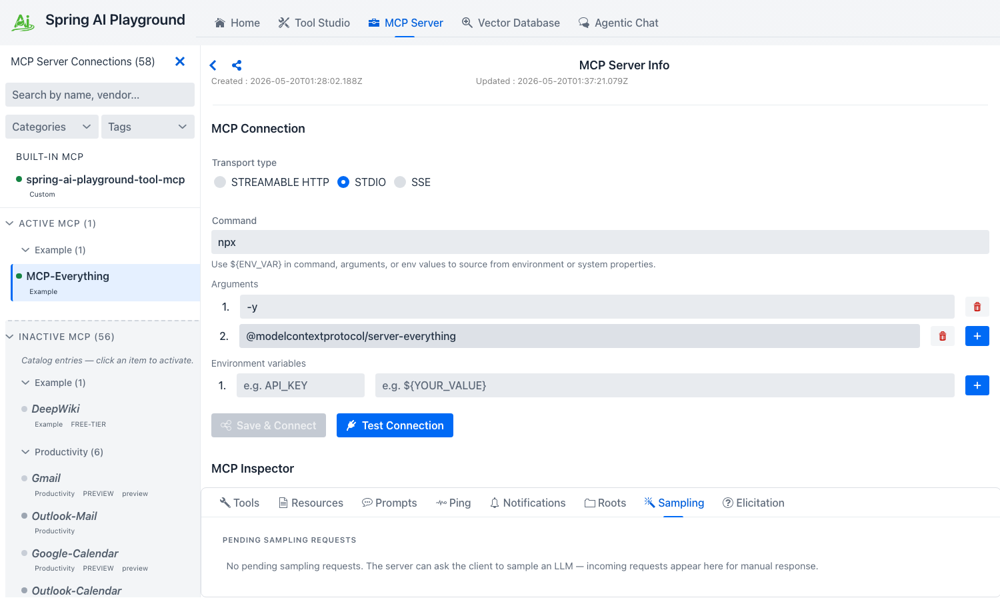
*The Sampling tab is where the two inverted primitives surface — incoming `sampling/createMessage` requests render as cards with Approve / Reject. Elicitation has the same shape under the **Elicitation** tab, except the response area is a JSON-Schema-typed form instead of a model turn.*

!!! note "Sampling and Elicitation routing"
    The playground's MCP client must advertise the `sampling` and `elicitation` capabilities during `initialize` for the server-side trigger to actually deliver a card here. Like roots, capability advertisement is on the roadmap; the tab + protocol path is wired and the trigger fires, but the round-trip to a Pending-card depends on the same negotiation pass.

!!! warning "Sampling is a human-in-the-loop gate"
    Approving a sampling request runs the server's chosen prompt against *your* configured model — it costs tokens and produces a response the server then acts on. Approve only what you would have approved if you had typed the prompt yourself.

## 9. Elicitation — answer a question the server asks the user

*Elicitation* is the third inverted primitive — the server asks the *user* a question mid-conversation by sending an `elicitation/create` request with a `prompt` plus a `requestedSchema` describing what answer it expects. The playground renders the form, the human fills it, the answer goes back.

1. From **Tools**, click **Run** on the **Trigger Elicitation Request Tool** card.
2. Switch to the **Elicitation** tab. An `ElicitationRequestPrimitive` card lands carrying the prompt text and a form rendered from the server's `requestedSchema` (same JSON-Schema-typed inputs the Tools tab uses).
3. Fill the form and click **Submit**. The answer ships back to the server; the card updates to show the response that was sent.
4. Optionally trigger elicitation again and click **Cancel** to return the spec-defined error instead.

The card stays in the feed afterwards as an audit record of what was asked and what was answered.

## Cleanup

You can leave **MCP Everything** activated — it is the right smoke test to keep around whenever you suspect the playground's MCP client wiring regressed. To remove it:

1. Open **MCP Server**, select the **MCP Everything** row in the **Active MCP** layer.
2. Click **Disconnect** on the right pane to stop the child process. The row stays in **Active MCP** but the status dot turns gray; click **Save & Connect** later to re-activate.
3. To fully remove the activation, use the row's **Delete** action — the entry returns to the **Inactive MCP** layer as a ghost row, ready to re-activate from the catalog template.

The persisted JSON for this connection lives under `~/spring-ai-playground/mcp/save/` and only stores the activation template + `${ENV_VAR}` placeholders. No tokens, no live secrets.

## Where to go next

- [MCP Inspector reference](../features/mcp-server/inspector.md) — every primitive explained against the MCP spec, with the Spring AI MCP SDK entry points.
- [Default MCP Servers → Examples](../features/default-mcp-catalog/examples.md) — full catalog spec, including DeepWiki (the other Examples-category entry).
- [Tutorial 2 — Connect an External MCP Server](2-external-mcp.md) — the manual path for anything *not* in the catalog (custom URL, custom STDIO command, custom OAuth issuer).
- [Default MCP Servers directory](../features/default-mcp-catalog/index.md) — browse all 57 preset connections across the six category cohorts.
- [Tool Studio](../features/tool-studio/index.md) — once you trust the playground's MCP client wiring against MCP Everything, build your own server-side tools that other clients will consume the same way.

