description: Tutorial 9 - activate MCP Everything from the catalog and drive every Inspector primitive (Tools · Resources · Prompts · Roots · Sampling · Elicitation).

# Tutorial 9 - MCP Everything: All 8 Primitives in One Walkthrough

**Time** 12 min · **Difficulty** ★★☆ · **Surfaces** MCP Server (catalog + Inspector)

!!! abstract "Goal"
    Activate **MCP Everything** from the Default MCP Servers and drive every Inspector primitive - Tools, Resources, Prompts, Ping, Notifications, Roots, Sampling, Elicitation - against a single server in one sitting. No credentials, no tenant setup; everything in this tutorial runs against a server that has no auth surface.

!!! info "Why MCP Everything"
    MCP Everything is the official MCP working group's reference test server. It is the **only** publicly available server that intentionally implements every protocol primitive - including the inverted client-side ones (Sampling, Elicitation) that real-world servers usually skip. If a primitive doesn't light up here, the bug is almost certainly on the *client* side (the playground), which is exactly why it's catalogued in the first place. For the per-primitive matrix and the catalog template, see [Default MCP Servers → Examples → MCP-Everything](../features/default-mcp-catalog/examples.md#MCP-Everything). For the spec-level "what each primitive is" explanation, see [MCP Inspector](../features/mcp-server/inspector.md).

## Prerequisites - Node.js 18+ (or Docker)

The catalog template ships per-OS STDIO commands that fetch and spawn `@modelcontextprotocol/server-everything` via `npx` (`npx.cmd` on Windows). You either need Node.js 18+ on the host, or you can switch to the Docker variant in one form edit.

=== "macOS"
    ```bash
    # Homebrew (recommended)
    brew install node

    # or the official installer
    # https://nodejs.org/en/download
    ```
    The catalog activates with `npx -y @modelcontextprotocol/server-everything` and works once `npx` is on `PATH`.

=== "Ubuntu / Debian"
    ```bash
    # Distro packages - quick path
    sudo apt update
    sudo apt install nodejs npm

    # Or nvm if you need a specific Node version
    curl -o- https://raw.githubusercontent.com/nvm-sh/nvm/v0.40.1/install.sh | bash
    nvm install --lts
    ```
    Verify with `node --version` (must report `v18.x` or newer).

=== "Fedora / RHEL"
    ```bash
    sudo dnf install nodejs npm
    # or for a specific stream:
    sudo dnf module install nodejs:20/common
    ```

=== "Windows"
    ```powershell
    # winget (PowerShell, recommended)
    winget install OpenJS.NodeJS.LTS

    # or the official installer
    # https://nodejs.org/en/download
    ```
    The catalog automatically picks the Windows variant (`npx.cmd`) when it detects the host OS.

=== "Docker (any OS)"
    If you'd rather not install Node, keep the transport on **STDIO** and switch the activation form's fields after clicking the catalog row:

    | Field | Value |
    |---|---|
    | **Command** | `docker` |
    | **Arguments** | `run`, `-i`, `--rm`, `mcp/everything` |

    Use the official `mcp/everything` image - it speaks the protocol over the container's stdin/stdout, which is what a STDIO connection needs, and **Test Connection** reports `Connection OK - discovered 8 tool(s).`

    !!! warning "The Docker image is an older build with a smaller surface"
        `mcp/everything` publishes **8 tools and 3 prompts** under different names - `add`, `annotatedMessage`, `echo`, `getResourceReference`, `getTinyImage`, `longRunningOperation`, `printEnv`, `sampleLLM`, and `simple_prompt` / `complex_prompt` / `resource_prompt`. The `npx` path pulls the current release and publishes **15 tools and 4 prompts** (`get-sum`, `get-annotated-message`, `trigger-sampling-request`, `trigger-elicitation-request`, `completable-prompt`, ...). Sections 3, 5, 8 and 9 below name the current tools, so **use the Node path to follow this walkthrough**; the container is fine as a quick smoke test that the playground's stdio client works at all.

    The `tzolov/mcp-everything-server:v2` image is the *HTTP* packaging of the same server: it prints `MCP Streamable HTTP Server listening on port 3001` and writes nothing to stdout, so a STDIO connection to it never initializes. To reach that one, publish the port (`docker run -p 3001:3001 tzolov/mcp-everything-server:v2`) and set the transport to **Streamable HTTP** against `http://localhost:3001` with endpoint `/mcp`.

!!! tip "MCP Everything needs no credentials"
    Unlike the other catalog entries (Gmail, Slack, GitHub, ...) that wrap a real account, MCP Everything is a **synthetic** server - every tool is implemented internally with mock data. You won't be asked for a token, a tenant ID, or an OAuth grant. That makes it the right first stop for verifying that the playground's MCP client wiring works end-to-end before you spend OAuth setup time on a real vendor.

## 1. Activate from the catalog

1. Open **MCP Server**. The left sidebar shows three layers - **Built-in MCP** (pinned), **Active MCP**, and **Inactive MCP** (the 58-entry catalog).
2. Scroll the **Inactive MCP** layer to the `Example` category group, or type `everything` into the filter bar at the top - both surface the **MCP Everything** entry.
3. Click the row. **You do not pick the OS variant manually** - the playground reads the host OS at startup and the configuration form opens already pre-filled with the matching command + args. The table below shows what gets selected for each platform:

    | Host OS | Command | Arguments |
    |---|---|---|
    | macOS / Linux | `npx` | `-y @modelcontextprotocol/server-everything` |
    | Windows | `npx.cmd` | `-y @modelcontextprotocol/server-everything` |

    !!! tip "Per-OS auto-selection covers every stdio catalog entry"
        The same mechanism applies to all 8 stdio entries in the catalog - Git, Puppeteer, Playwright, Memory, Sequential Thinking, SQLite, Brave Search, and MCP Everything. Each ships in three OS-specific JSON variants (`default-mcp-specs-stdio-mac.json` / `-linux.json` / `-windows.json` under `src/main/resources/mcp/`), and the sidebar surfaces only the variant matching your host so the pre-filled command works without editing. macOS / Linux variants use `npx` or `uvx`; Windows variants use `npx.cmd`. See [MCP Server → Catalog & Sidebar Filtering](../features/mcp-server/index.md#catalog-sidebar-filtering) for the mechanism.

4. *(Docker alternative only)* Replace **Command** with `docker` and **Arguments** with `run`, `-i`, `--rm`, `mcp/everything` - and read the warning in the Docker tab above first: that image is an older build and does not carry the tools the rest of this walkthrough names. If `docker` is not on the `PATH` the playground's own process sees, use its absolute path.
5. Click **Test Connection** first - its tooltip says it all: *Try to initialize without saving - verifies URL, headers, and env vars*. A transient client runs `initialize` + one-shot `listTools` without touching the live connection map, and reports back as `Connection OK - discovered 13 tool(s).` A green OK tells you the spawn + JSON-RPC handshake works on your host. (The live connection lists more - see the note under Tools.)
6. Click **Save & Connect**. The row moves from **Inactive MCP** into **Active MCP** under the `Example` category, and the status dot turns green.

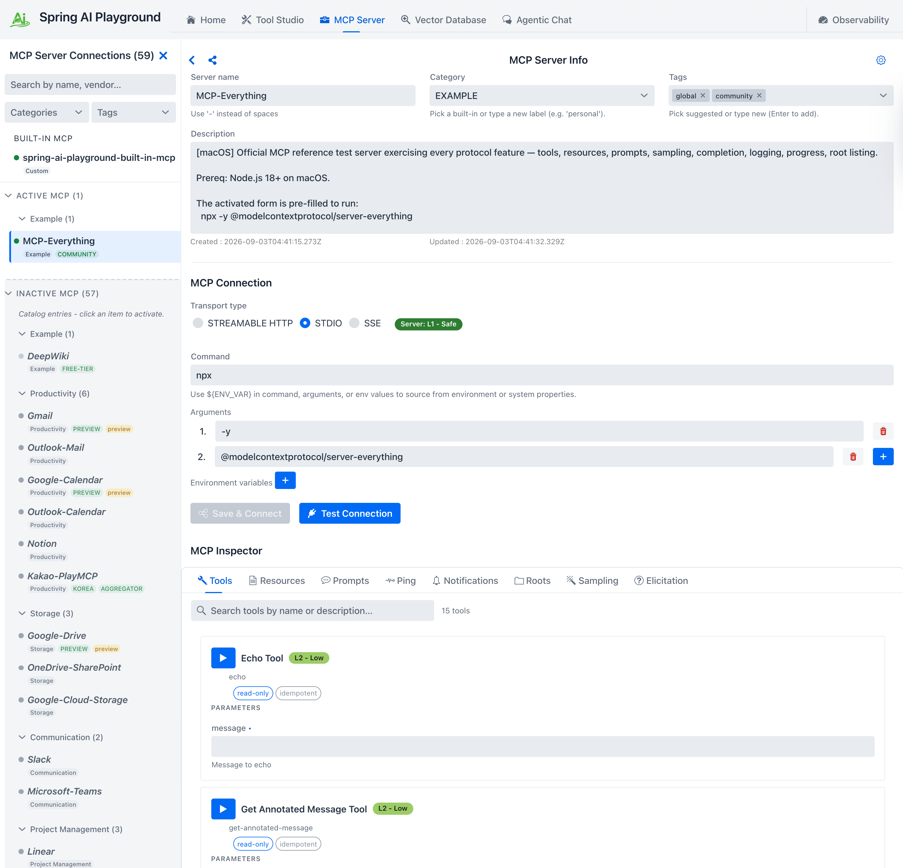
*The configuration form opens already filled in with the host-OS variant - `npx` on macOS/Linux, `npx.cmd` on Windows - with the transport switched to **STDIO** so the URL/Endpoint pair is replaced by **Command** + numbered **Arguments** and an **Environment variables** row. The server risk chip reads `Server: L1 - Safe` (a catalogued community server, not an unverified one). **Save & Connect** then promotes the row into Active MCP under the Example group.*

!!! tip "If the status dot stays gray or turns red"
    The most common causes are missing `npx` on `PATH` (Node not installed or shell not refreshed), or the host blocking the npm registry. Switch to the Docker variant on the same form and click **Save & Connect** again - that bypasses both.

## 2. Verify connectivity with Ping

The connection's right pane now exposes the **MCP Inspector** below the form. Eight tabs sit side by side; the default selection is **Tools**.

1. Click the **Ping** tab.
2. Click the single play button on the Ping card.
3. The result lands inline - an `OK` badge, the method name, elapsed milliseconds, the local clock time of the call, and an empty `RESPONSE` body (`{ }`, which is what a successful ping returns). If it's an ERROR, the transport itself is unhealthy; everything else in this tutorial will fail until ping succeeds.

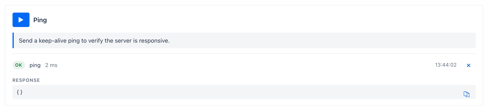
*A single play button, an `OK` badge, the round-trip duration (`2 ms` here) and the time of the call - the smallest possible end-to-end JSON-RPC check.*

Ping proves the JSON-RPC channel is alive end-to-end *independent of any tool or resource call* - which is why it's the right first signal after Save & Connect. See [Inspector → Ping](../features/mcp-server/inspector.md#ping) for the spec context.

## 3. Tools - call three representative tools

Switch to the **Tools** tab. Each tool the server publishes from `tools/list` renders as a full-width card: the display name, its **risk chip**, the raw MCP tool name underneath (`echo`, `get-sum`, ...), the server's behaviour hints as chips (`read-only`, `idempotent`, `open-world`), the schema-typed inputs, and a play button whose tooltip reads **Run tool**. The header counts `15 tools`, two more than the transient **Test Connection** probe reported: MCP Everything states that its two callback triggers (`trigger-sampling-request`, `trigger-elicitation-request`) require a client that advertised the matching capability, and only the live connection does. You'll exercise three tools that demonstrate three different shapes of input and output.

### Echo - the simplest possible round-trip

1. Find the **Echo Tool** card.
2. Type `hello from playground` into the `message` input.
3. Click the play button.
4. The inline result panel shows OK, elapsed ms, the REQUEST block (the JSON-RPC args you sent), the RESPONSE block (the server's echo), and a **Raw** toggle that swaps in the full JSON-RPC envelope.

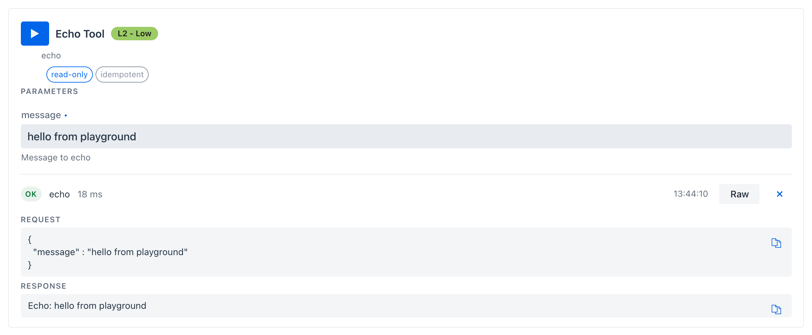
*The same REQUEST / RESPONSE / Raw layout every Tools call uses - the round-trip envelope is one toggle away when you need to debug at the wire level.*

### Get Sum - typed numeric inputs

1. Scroll to the **Get Sum Tool** card (raw name `get-sum`; the playground shows the display name first). The two `a` / `b` fields render as **number inputs** because the JSON Schema declares `"type": "number"`.
2. Enter `2` and `3`.
3. Click the play button. The response reads `The sum of 2 and 3 is 5.`

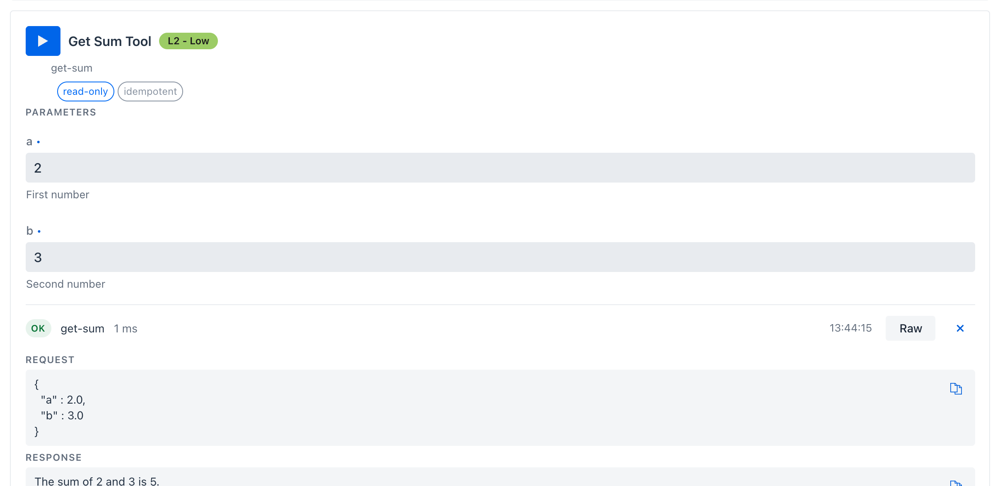
*The schema declared `"type": "number"`, so the Inspector renders proper numeric inputs - not free-text - and the REQUEST block echoes them typed: `{ "a" : 2.0, "b" : 3.0 }`.*

This is how the Inspector's input controls track JSON Schema - boolean → checkbox, enum → dropdown, array/object → JSON editor. See [Inspector → Tools](../features/mcp-server/inspector.md#tools) for the full mapping.

### Get Annotated Message - content annotations + image content

1. Find the **Get Annotated Message Tool** card. It exposes a `messageType` **Select** (enum: `error` · `success` · `debug`) and an `includeImage` **checkbox**.
2. Pick `success`, check the box, click the play button.
3. The response is a structured `content` array. The Inspector prints the text block (`Operation completed successfully`) and adds a second, attachment-style row for the base64 image block. The `annotations` the server attaches to the text block (priority + audience hints a model can lean on) are not broken out in this view - open the **Raw** toggle to read them off the JSON-RPC envelope.

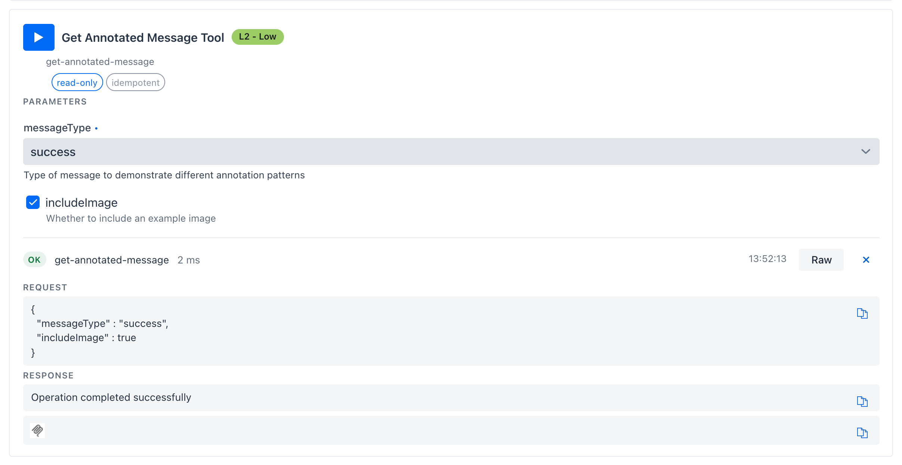
*A `success` message with `includeImage` ticked: REQUEST shows the typed arguments, RESPONSE shows the text block, and the image block lands under it as its own row. Each block has its own copy button, and **Raw** swaps the whole panel for the JSON-RPC envelope.*

!!! tip "Validate every new tool here first"
    Tools that fail in the Inspector fail in Agentic Chat too, but the chat error is wrapped in the agent's reasoning trace and harder to debug. Save yourself a turn - run every new tool here once before letting a model invoke it.

## 4. Resources - static URIs and templated URIs

Switch to the **Resources** tab. The Inspector splits the section into two sub-sections - `RESOURCES (N)` for the server's static URIs and `RESOURCE TEMPLATES (N)` for parameterised templates.

### Read a static resource

1. The `RESOURCES 7` header reflects MCP Everything's synthetic static set - seven `demo://resource/static/document/*.md` entries (`architecture.md`, `extension.md`, `features.md`, `how-it-works.md`, `instructions.md`, `startup.md`, `structure.md`).
2. Pick any card (the first one, `architecture.md`, is fine). The card shows the URI, the server-declared `mimeType` chip (`text/markdown`), and a server-supplied description.
3. Click the card's play button (tooltip: **Read resource**). The body lands inline as `CONTENTS` - text content renders verbatim, binary content surfaces as a base64 preview.

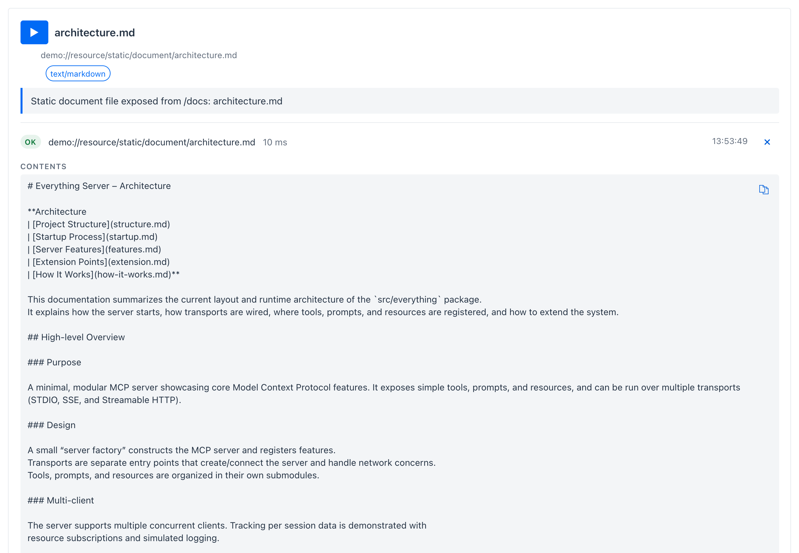
*Each row reads its URI inline - no tab switch, no separate viewer. The `text/markdown` chip and the OK badge confirm the mimeType and round-trip duration the server reported.*

### Read a templated resource

1. Below the static list, the `RESOURCE TEMPLATES 2` section exposes two parameterised templates - `demo://resource/dynamic/text/{resourceId}` and `demo://resource/dynamic/blob/{resourceId}`.
2. Pick the **Dynamic Text Resource** template. The card renders a `VARIABLES` block with a JSON-Schema-typed input for `resourceId`. The description warns that the variable **must be an integer**.
3. Type `42` into `resourceId` and click the play button (tooltip: **Expand template and read**). The server substitutes the variable, resolves the URI to `demo://resource/dynamic/text/42`, and returns a body keyed on the variable - `Resource 42: This is a plaintext resource created at ...`.

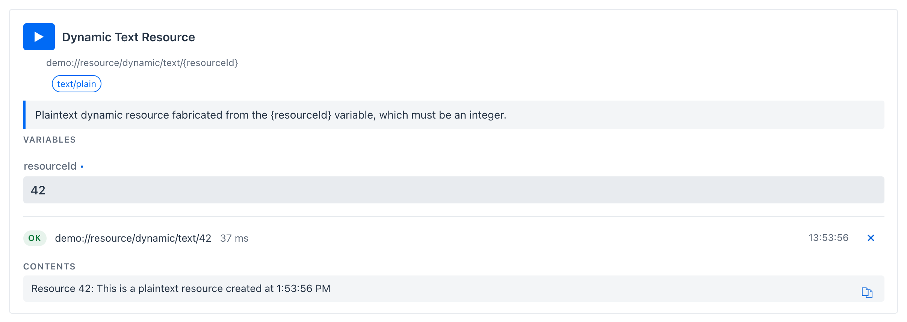
*Templates declare their URI variables with JSON-Schema-typed inputs - same control pool the Tools tab draws from - and the resolved URI (`demo://resource/dynamic/text/42`) lands above the body so you can confirm the substitution worked.*

See [Inspector → Resources](../features/mcp-server/inspector.md#resources) for the static / template distinction in the MCP spec.

## 5. Prompts - simple, arguments, and completable

Switch to the **Prompts** tab. Prompts are named, parameterised message templates the server can render for the client. MCP Everything publishes four - `simple-prompt`, `args-prompt`, `completable-prompt`, and `resource-prompt` (which embeds a resource reference) - covering the shapes you'll meet in the wild.

### `simple-prompt` - no arguments

1. The `Simple Prompt` card has only a name and a description.
2. Click its play button (tooltip: **Get prompt**). The server returns a rendered `MESSAGES` list ready to feed a model. There is nothing to fill in because the prompt takes no arguments.

### `args-prompt` - required + optional arguments

1. The `Arguments Prompt` card requires `city` and accepts an optional `state`.
2. Fill in `city: Seoul`, `state: South Korea`.
3. Click the play button. The rendered `MESSAGES` list substitutes your values into the server's template - one `USER` message reading `What's weather in Seoul, South Korea?`

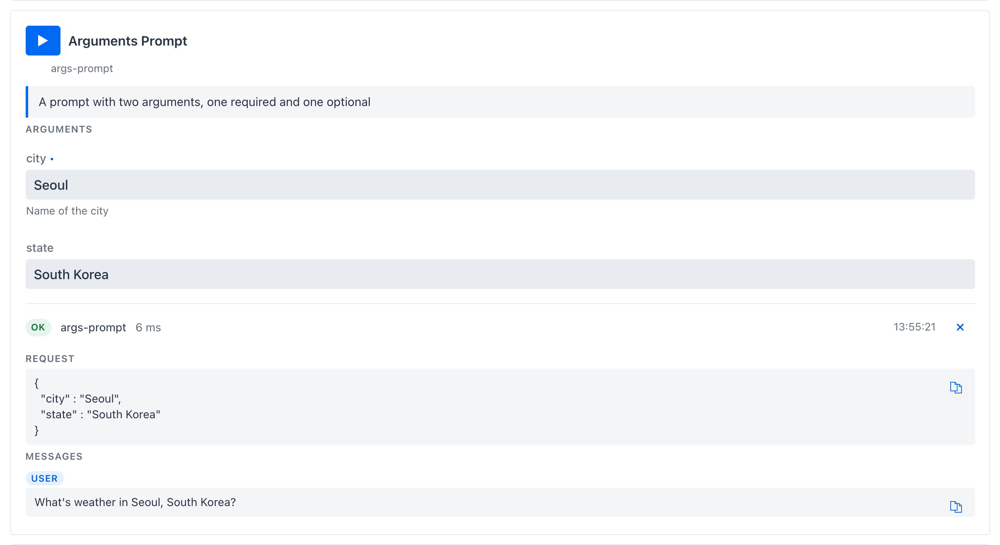
*The `MESSAGES` list is what a chat client would feed straight into a model, each entry tagged with its role - the playground shows it verbatim so you can sanity-check the substitution before wiring it into Agentic Chat.*

### `completable-prompt` - two linked arguments

1. The `Team Management` card takes two required arguments, and its description states the contract: *First argument choice narrows values for second argument.* `department` is declared **completable** on the server side, and `name` is meant to follow from it.
2. Type a value into `department`, then one into `name`, and click the play button to render the prompt.

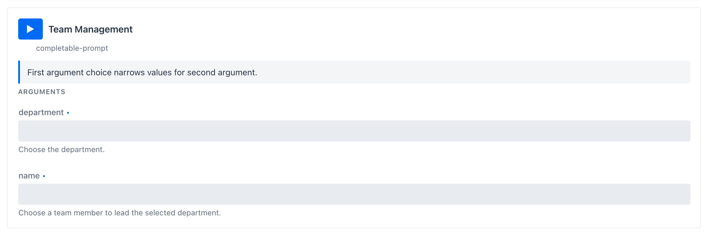
*Both arguments are required (`•`) and both render as plain text fields.*

!!! note "Argument completion is not wired yet"
    The server advertises the `completions` capability and declares `department` as completable, but the Inspector does not call `completion/complete` - typing into the field surfaces no suggestions. Type the value yourself. This is the one MCP primitive in this walkthrough that the playground does not exercise.

See [Inspector → Prompts](../features/mcp-server/inspector.md#prompts) for the spec contract.

## 6. Notifications - turn on the live feed

Notifications are *unsolicited* messages from the server to the client - list-changed events, structured log records, progress updates. Switching to the Notifications tab right after connect already shows a few - MCP Everything emits a `TOOLS_CHANGED` notification on every reconnect so the client can re-fetch `tools/list`.

1. Switch to **Notifications**. You'll already see a small set of `TOOLS_CHANGED` rows - `Tools list changed (15)`, timestamped around when MCP Everything finished its initial handshake. Each row shows a topic chip, a one-line summary, and the clock time it arrived.
2. Anything the server pushes later joins the same feed. Triggering sampling (section 8) adds a red `SAMPLING_REQUEST` row - `Sampling request received (1 messages)` - the moment the server calls back into the client.
3. **Set logging level...** sends `logging/setLevel` *to the server*, changing what it decides to push; it is not a client-side filter. **Clear** empties the local feed.

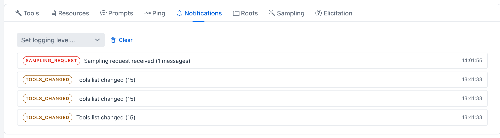
*Server push notifications only surface here - chat will never show them, so this tab is the source of truth for what change events a server actually emits. The feed also models `PROGRESS` records; those arrive only when the caller supplies a progress token, which the Inspector's tool calls do not, so running **Trigger Long Running Operation Tool** adds nothing here.*

!!! tip "Why this tab matters"
    The chat surface does not surface server push notifications - they only land here. This tab is the canonical way to verify that an external server actually emits the change events it claims to before you wire that behaviour into chat-side code.

## 7. Roots - advertise a directory to the server

A *root* is a file or URI the playground (acting as the MCP client) advertises to the server as something the server may operate on. MCP Everything calls `roots/list` on startup; you decide what it sees.

1. Switch to the **Roots** tab. The default state is empty - "No roots advertised."
2. Fill in the inline form:
    - **URI** - `file:///tmp/mcp-demo` (any URI you want the server to see)
    - **Name** - `mcp-demo` (optional human-readable label)
3. Click **Add Root**. The root is stored locally and listed under **CONFIGURED ROOTS**, each row with a red `x` to remove it, and the playground then attempts to push `notifications/roots/list_changed` to the server.

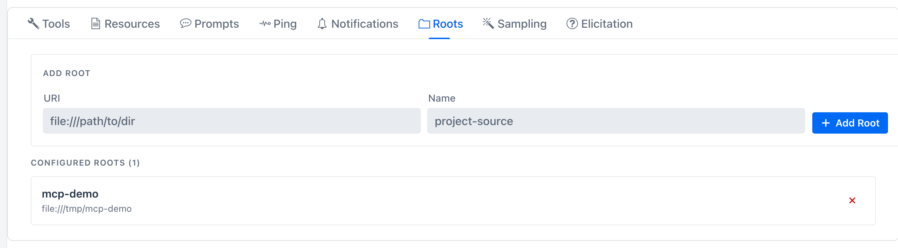
*The ADD ROOT form takes a URI plus an optional human-readable label (its placeholders show the shape: `file:///path/to/dir` and `project-source`). Both are required - submitting an empty pair reports `URI and Name are required`. The added root lands under **CONFIGURED ROOTS (1)**.*

!!! warning "Roots capability negotiation"
    The root is added to the local list, but the push to the server fails with a **`Failed: Client must be configured with roots capabilities`** toast - the playground's MCP client does not declare the `roots` capability during `initialize`. So the server never learns about it. The form, the local list, and the protocol path are wired; the client-side capability advertisement is on the roadmap.

!!! note "Roots are advisory, not enforcement"
    Adding a root does **not** grant the server filesystem access. It only tells the server "if you do filesystem-style operations, here are the URIs I've opted to expose." Enforcement lives in the playground's sandbox (`safety.fs`), not in the roots list. See [Inspector → Roots](../features/mcp-server/inspector.md#roots) for the spec context.

## 8. Sampling - let the server run a model turn through the playground

*Sampling* inverts the usual direction: the server asks the playground (the client) to run a model turn on its behalf, returning the assistant message back to the server. This is how a server-side agent loop can recurse into the user's model without bringing its own API credentials.

1. Go back to **Tools** and find the **Trigger Sampling Request Tool** card. It takes a `prompt` (the text the server will ask the client to complete) and an optional `maxTokens`. Fill the prompt - `Say hello in one short sentence.` - and click the play button.
2. Switch to the **Sampling** tab. A **Sampling request** card lands under `PENDING SAMPLING REQUESTS`, its `REQUEST` block holding exactly what the server sent: the `messages` array, the server's own `systemPrompt`, `temperature`, and `maxTokens`.
3. Type the assistant message into **YOUR RESPONSE (TEXT)** and click **Send**. The playground wraps your text as an `assistant` message with `stopReason: END_TURN` and returns it to the server.
4. **Decline** answers instead with the fixed text `User declined.` and `stopReason: STOP_SEQUENCE` - still a well-formed result, so the server can branch its agent loop on it.

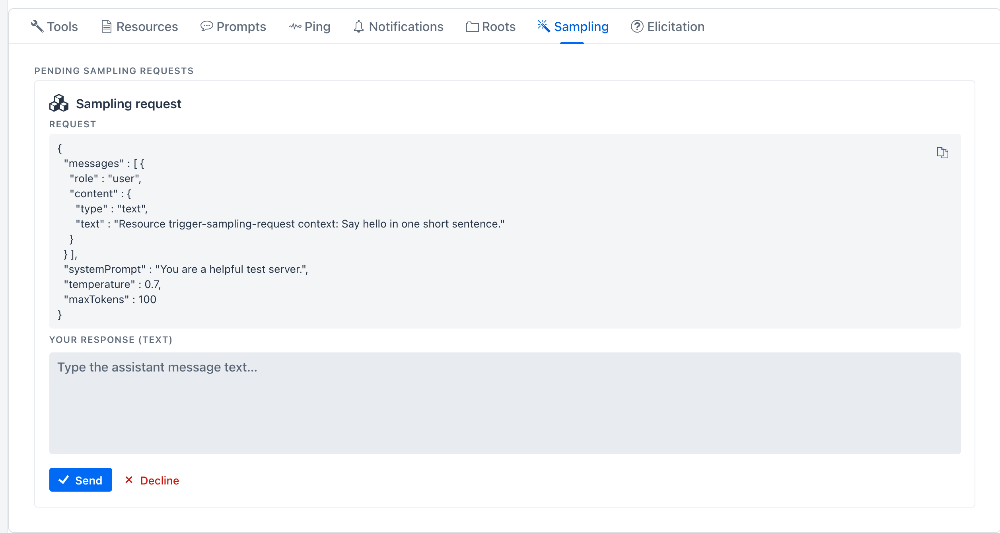
*Incoming `sampling/createMessage` requests render as cards with the server's full request, a free-text response box, and Send / Decline.*

!!! warning "You are the model here"
    This is a manual seam, not an automatic one: the playground does **not** run the server's prompt through a model. Whatever you type in the response box is what the server receives as the assistant turn. Nothing is sent to Ollama or OpenAI, and no tokens are spent.

!!! warning "The triggering tool call times out"
    The `trigger-sampling-request` call blocks on your answer and gives up after 20 seconds - the Tools card reports a crash (`TimeoutException`) even though the Sampling card is still sitting there waiting. Answer the card anyway; the timeout only ends the tool call, not the sampling request.

## 9. Elicitation - answer a question the server asks the user

*Elicitation* is the third inverted primitive - the server asks the *user* a question mid-conversation by sending an `elicitation/create` request with a `prompt` plus a `requestedSchema` describing what answer it expects. The playground renders the form, the human fills it, the answer goes back.

1. From **Tools**, click the play button on the **Trigger Elicitation Request Tool** card (no inputs).
2. Switch to the **Elicitation** tab. A card lands under `PENDING ELICITATION REQUESTS` carrying the server's prompt - `Please provide inputs for the following fields:` - and a **FORM** rendered from its `requestedSchema`. MCP Everything asks for a deliberately wide spread of types: a required `name`, a `check` checkbox, free text, an email, a URL, a date, an integer, a number, and four enum fields (single- and multi-select, titled and untitled).
3. Fill the form and click **Accept** - the answers ship back as an `ElicitResult` with action `ACCEPT`.
4. **Decline** and **Cancel** send the other two spec-defined actions (`DECLINE`, `CANCEL`) with an empty payload, so the server can tell "no thanks" apart from "not now".

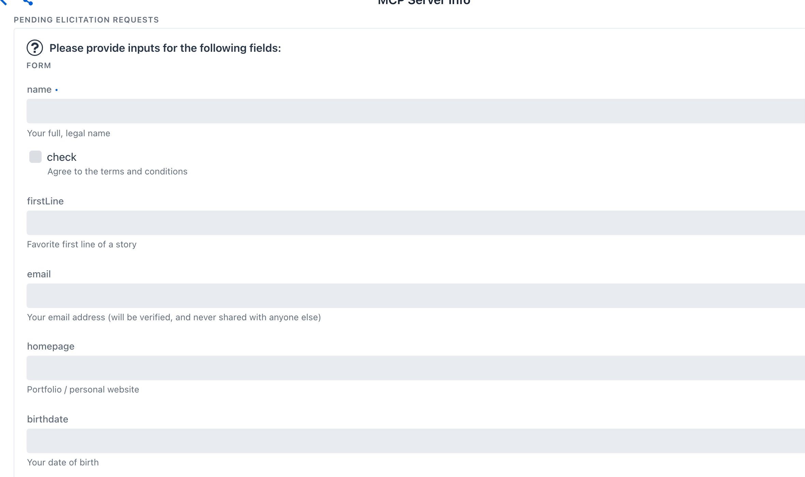
*Same seam as Sampling, but the response area is a JSON-Schema-typed form instead of a text box - each field carries the server's own description, and required ones are marked with a `•`.*

The same 20-second tool timeout applies: `trigger-elicitation-request` crashes while the card waits for you. Answer the card anyway.

## Cleanup

You can leave **MCP Everything** activated - it is the right smoke test to keep around whenever you suspect the playground's MCP client wiring regressed. To remove it:

1. Open **MCP Server** and select the **MCP-Everything** row in the **Active MCP** layer.
2. Click the **x** icon in the sidebar header - its tooltip reads *Delete Selected MCP Server*. Confirm the `Are you sure you want to delete this MCP server connection permanently?` dialog.
3. The activation is removed and the child `npx` process goes with it. The catalog template is untouched, so the entry reappears under **Inactive MCP** ready to activate again. (There is no separate disconnect action - the built-in server and inactive catalog rows both refuse deletion, so the x only ever removes an activation you made.)

The persisted JSON for this connection lives under `~/spring-ai-playground/mcp/save/` and only stores the activation template + `${ENV_VAR}` placeholders. No tokens, no live secrets.

## Where to go next

- [MCP Inspector reference](../features/mcp-server/inspector.md) - every primitive explained against the MCP spec, with the Spring AI MCP SDK entry points.
- [Default MCP Servers → Examples](../features/default-mcp-catalog/examples.md) - full catalog spec, including DeepWiki (the other Examples-category entry).
- [Tutorial 2 - Connect an External MCP Server](2-external-mcp.md) - the manual path for anything *not* in the catalog (custom URL, custom STDIO command, custom OAuth issuer).
- [Default MCP Servers directory](../features/default-mcp-catalog/index.md) - browse all 58 preset connections across the six category cohorts.
- [Tool Studio](../features/tool-studio/index.md) - once you trust the playground's MCP client wiring against MCP Everything, build your own server-side tools that other clients will consume the same way.

