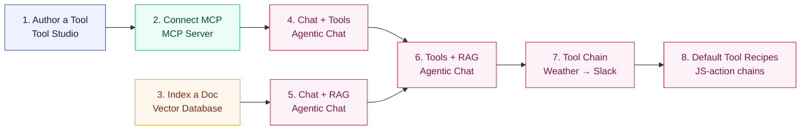

description: End-to-end Spring AI Playground tutorials — Tool Studio authoring, MCP servers, vector RAG, default-tool recipes, and Agentic Chat.

# Tutorials

These eight tutorials walk you from creating a single tool to composing chains over the bundled default catalog. They follow the natural product workflow: build → validate → ground → compose.

The shipped chat default is **`qwen3.5:2b`** — fast, fine for the early tutorials. Switch to **`qwen3.5:latest`** or **`gemma4:latest`** when you reach tutorials 4–7, where tool-calling reliability matters. Embeddings use **`qwen3-embedding:0.6b`** throughout. See [Picking a model](#picking-a-model) for the tradeoffs.

## How these tutorials connect



Tutorials 1–3 produce reusable assets (a tool, an MCP connection, an indexed document). Tutorials 4–8 compose those assets in chat (4–6) and as code-level chains over the bundled default catalog (7–8). Each tutorial is independently runnable in 3–8 minutes; the full sequence takes about 35 minutes.

!!! abstract "What you'll need"
    - Spring AI Playground running on `http://localhost:8282`. Follow [Getting Started](../getting-started.md) first if you haven't.
    - Ollama running, with `qwen3.5:latest` and `qwen3-embedding:0.6b` pulled.
        ```bash
        ollama pull qwen3.5
        ollama pull gemma4
        ollama pull qwen3-embedding:0.6b
        ```
    - For Tutorial 7 only: `SLACK_WEBHOOK_URL` set in the launcher's Environment Variables.

## Tutorial list

<div class="grid cards" markdown>

-   :material-wrench:{ .lg .middle } **[1. Author and Validate a Tool](1-author-tool.md)**

    ---

    `getWeather` from Starter 5 → Local Pass → MCP exposure.  
    **8 min** · ★☆☆ · Tool Studio + MCP Server

-   :material-connection:{ .lg .middle } **[2. Connect an External MCP Server](2-external-mcp.md)**

    ---

    Streamable HTTP / STDIO / SSE / OAuth 2.1, validated in the Inspector.  
    **8 min** · ★★☆ · MCP Server

-   :material-file-document-plus:{ .lg .middle } **[3. Index a Document for RAG](3-index-document.md)**

    ---

    Upload → chunk → embed → similarity-search validate.  
    **6 min** · ★☆☆ · Vector Database

-   :material-chat-question:{ .lg .middle } **[4. Chat With Tools](4-chat-tools.md)**

    ---

    Real tool call from a chat turn — see plan → call → answer.  
    **5 min** · ★★☆ · Agentic Chat

-   :material-book-search:{ .lg .middle } **[5. Chat With RAG](5-chat-rag.md)**

    ---

    Grounded chat on the indexed document — no tools.  
    **5 min** · ★★☆ · Agentic Chat + Vector Database

-   :material-merge:{ .lg .middle } **[6. Tools and RAG Together](6-tools-and-rag.md)**

    ---

    One turn that retrieves chunks AND calls a tool — full composition.  
    **6 min** · ★★★ · Agentic Chat (full)

-   :material-link-variant:{ .lg .middle } **[7. Weather to Slack — A Two-Tool Chain](7-weather-to-slack.md)**

    ---

    `getWeather` → `sendSlackMessage` in one prompt — the agent loop.  
    **4 min** · ★★★ · Agentic Chat

-   :material-source-branch:{ .lg .middle } **[8. Default Tool Recipes](8-default-tool-recipes.md)**

    ---

    Three new tools that chain default-tool helpers inside one JS action.  
    **12 min** · ★★★ · Tool Studio + Agentic Chat

</div>

## Picking a model

Tool calling and tool chaining quality depend heavily on the model. The selectable list in **Agentic Chat → Settings → Model** is driven by `application.yaml`'s `playground.chat.models`. The shipped default is the small one — start there, and only upgrade if a tool turn comes back empty.

=== "qwen3.5:2b (default)"
    The shipped default. **2.7 GB**. Fast on Apple Silicon. Use this for the chat sanity check **before** wiring up tools or RAG. Tool calling is best-effort — if a tool turn comes back empty, that is the signal to upgrade, not to rewrite the prompt.

=== "qwen3.5:latest"
    **6.6 GB**. Stronger tool calling and multi-turn reasoning. The first upgrade target when `qwen3.5:2b` skips a tool call.

=== "gemma4:latest"
    **9.6 GB**. Strongest natural-language quality. Pick this for tutorial 7 (multi-step tool chains) where the model has to *reason about* a tool result rather than just call it.

=== "gpt-oss:latest"
    **13 GB**. OpenAI's open-weights reasoning model. A good cross-check when you suspect a result depends heavily on which model family you picked.

!!! tip "Where the model selector lives"
    Open Agentic Chat, click the **gear** icon at the top right, change `Model`, then click **Apply & New Chat**. The chat header reflects the change.

## Further Reading

- [Overview](../index.md): return to the main product overview and documentation map
- [Getting Started](../getting-started.md): install the app, configure providers, and choose a runtime
- [Architecture](../architecture.md): runtime layers, data flows, and extension points
- [Features](../features/index.md): the main product areas and what they do
