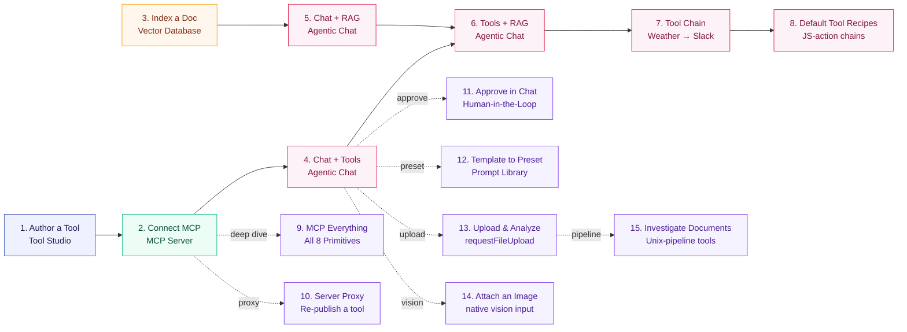

description: End-to-end Spring AI Playground tutorials - Tool Studio authoring, MCP servers, vector RAG, default-tool recipes, and Agentic Chat.

# Tutorials

These fifteen tutorials walk you from creating a single tool to composing chains over the bundled default catalog, with optional deep-dives off the main path - the MCP protocol surface, re-publishing tools through the MCP Server Proxy, gating tool calls behind human approval, turning a Prompt Library template into a reusable preset, uploading a file into chat for an agent to analyze, attaching an image for a vision model to see, and investigating documents with a filesystem pipeline. They follow the natural product workflow: build → validate → ground → compose.

The shipped chat default is **`qwen3.5:4b`** - fast, vision-capable, fine for the early tutorials. Switch to **`qwen3.5:9b`** or **`gemma4:e4b`** when you reach tutorials 4-7, where tool-calling reliability matters. Embeddings use **`qwen3-embedding:0.6b`** throughout. See [Picking a model](#picking-a-model) for the tradeoffs.

## How these tutorials connect



Tutorials 1-3 produce reusable assets (a tool, an MCP connection, an indexed document). Tutorials 4-8 compose those assets in chat (4-6) and as code-level chains over the bundled default catalog (7-8). Tutorial 9 is an optional **deep dive** off Tutorial 2 - activate MCP Everything from the Default MCP Servers and exercise every Inspector primitive (Tools / Resources / Prompts / Ping / Notifications / Roots / Sampling / Elicitation) end-to-end. Tutorial 10 is a second deep dive off Tutorial 2 - re-publish a connected server's tool through the built-in [MCP Server Proxy](../features/mcp-server/proxy.md) so chat and external clients can call it. Each tutorial is independently runnable in 3-20 minutes; the full main sequence takes about 50 minutes, plus ~44 minutes for the deep dives (MCP Everything, Server Proxy, Human-in-the-Loop approval, the file and image attachments, and the document pipeline).

!!! abstract "What you'll need"
    - Spring AI Playground running on `http://localhost:8282`. Follow [Getting Started](../getting-started/index.md) first if you haven't.
    - Ollama running, with `qwen3.5:9b` and `qwen3-embedding:0.6b` pulled.
        ```bash
        ollama pull qwen3.5:9b
        ollama pull gemma4:e4b
        ollama pull qwen3-embedding:0.6b
        ```
    - For Tutorial 7 only: `SLACK_WEBHOOK_URL` set in the launcher's Environment Variables.

## Tutorial list

<div class="grid cards" markdown>

-   :material-wrench:{ .lg .middle } **[1. Author and Validate a Tool](1-author-tool.md)**

    ---

    `getWeather` from Starter 5 → Local Pass → MCP exposure.  
    **8 min** · ★☆☆ · Tool Studio + MCP Server

-   :material-connection:{ .lg .middle } **[2. Connect an External MCP Server](2-external-mcp.md)**

    ---

    Streamable HTTP / STDIO / SSE / OAuth 2.1, validated in the Inspector.  
    **8 min** · ★★☆ · MCP Server

-   :material-file-document-plus:{ .lg .middle } **[3. Index a Document for RAG](3-index-document.md)**

    ---

    Upload → chunk → embed → similarity-search validate.  
    **6 min** · ★☆☆ · Vector Database

-   :material-chat-question:{ .lg .middle } **[4. Chat With Tools](4-chat-tools.md)**

    ---

    Real tool call from a chat turn - see plan → call → answer.  
    **5 min** · ★★☆ · Agentic Chat

-   :material-book-search:{ .lg .middle } **[5. Chat With RAG](5-chat-rag.md)**

    ---

    Grounded chat on the indexed document - no tools.  
    **5 min** · ★★☆ · Agentic Chat + Vector Database

-   :material-merge:{ .lg .middle } **[6. Tools and RAG Together](6-tools-and-rag.md)**

    ---

    One turn that retrieves chunks AND calls a tool - full composition.  
    **6 min** · ★★★ · Agentic Chat (full)

-   :material-link-variant:{ .lg .middle } **[7. Weather to Slack - A Two-Tool Chain](7-weather-to-slack.md)**

    ---

    `getWeather` → `sendSlackMessage` in one prompt - the agent loop.  
    **4 min** · ★★★ · Agentic Chat

-   :material-source-branch:{ .lg .middle } **[8. Default Tool Recipes](8-default-tool-recipes.md)**

    ---

    Five new custom tools, each chaining default-tool helpers inside one JS action.  
    **20 min** · ★★★ · Tool Studio + Agentic Chat

-   :material-flask-outline:{ .lg .middle } **[9. MCP Everything - All 8 Primitives](9-mcp-everything.md)**

    ---

    Activate the Default MCP Servers's reference test server and exercise every Inspector primitive - Tools, Resources, Prompts, Ping, Notifications, Roots, Sampling, Elicitation - in one sitting. OS-specific Node install or Docker alternative.  
    **12 min** · ★★☆ · MCP Server (catalog + Inspector) · *deep dive*

-   :material-transit-connection-variant:{ .lg .middle } **[10. Proxy an MCP Server](10-proxy-external-tool.md)**

    ---

    Re-publish a whole MCP server - or a curated mix of several - through the built-in server, each tool risk-capped, HITL-gated, and logged; then call it from chat and external `/mcp` clients.  
    **8 min** · ★★☆ · MCP Server · *deep dive*

-   :material-account-check:{ .lg .middle } **[11. Approve a Tool in Chat](11-human-approval.md)**

    ---

    Turn on human-in-the-loop approval, then approve or decline a tool call live in chat.  
    **6 min** · ★★☆ · Tool Studio + Agentic Chat · *deep dive*

-   :material-clipboard-text:{ .lg .middle } **[12. Build a Preset from a Template](12-template-to-preset.md)**

    ---

    Fill a template's variables and save the assembled prompt as a named, reusable preset with the Save as preset dialog.  
    **6 min** · ★★☆ · Agentic Chat · *deep dive*

-   :material-file-upload:{ .lg .middle } **[13. Upload and Analyze a File](13-upload-a-file.md)**

    ---

    Upload a CSV or Excel file with the interactive requestFileUpload tool, then have the agent read and analyze it.  
    **7 min** · ★★☆ · Agentic Chat · *deep dive*

-   :material-image-search-outline:{ .lg .middle } **[14. Attach and Analyze an Image](14-analyze-an-image.md)**

    ---

    Attach an image to the chat and have a local vision model analyze it, then re-reference it later with describeImage.  
    **5 min** · ★☆☆ · Agentic Chat · *deep dive*

-   :material-text-box-search-outline:{ .lg .middle } **[15. Investigate Documents with a Pipeline](15-investigate-documents.md)**

    ---

    Upload a contract with the Document detective preset and pull facts out of it the Unix-pipeline way - find, grep, slice, quote with line numbers.  
    **6 min** · ★★☆ · Agentic Chat · *deep dive*

</div>

## Picking a model

Tool calling and tool chaining quality depend heavily on the model. The selectable list in **Agentic Chat → Settings → Model** is driven by `application.yaml`'s `playground.chat.models`. The shipped default is the small one - start there, and only upgrade if a tool turn comes back empty.

=== "qwen3.5:4b (default)"
    The shipped default. **3.4 GB**. Fast on Apple Silicon, and the smallest build that ships vision tensors, so image attachments work out of the box. Use this for the chat sanity check **before** wiring up tools or RAG. Tool calling is best-effort - if a tool turn comes back empty, that is the signal to upgrade, not to rewrite the prompt.

=== "qwen3.5:9b"
    **6.6 GB**. Stronger tool calling and multi-turn reasoning. The first upgrade target when `qwen3.5:4b` skips a tool call.

=== "gemma4:e4b"
    **9.6 GB**. Strongest natural-language quality. Pick this for tutorial 7 (multi-step tool chains) where the model has to *reason about* a tool result rather than just call it.

=== "gpt-oss:20b"
    **13 GB**. OpenAI's open-weights reasoning model. A good cross-check when you suspect a result depends heavily on which model family you picked.

!!! tip "Where the model selector lives"
    Open Agentic Chat, click the **gear** icon at the top right, change `Model`, then click **Apply & New Chat**. The chat header reflects the change.

## Further Reading

- [Overview](../index.md): return to the main product overview and documentation map
- [Getting Started](../getting-started/index.md): install the app, configure providers, and choose a runtime
- [Architecture](../architecture.md): runtime layers, data flows, and extension points
- [Features](../features/index.md): the main product areas and what they do
